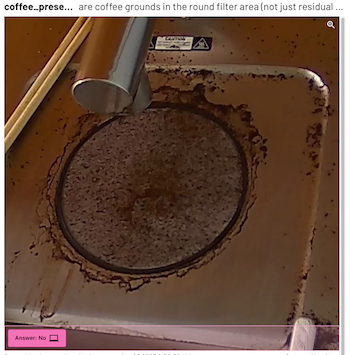

# Coffee machine demo

Keeps an eye on the clover coffee machine in the Groundlight office, and alerts if somebody forgets to rinse.

This demonstrates how to use the Groundlight Python SDK to:
- Set up a simple logic loop to watch for a specific condition
- Fetch images from an RTSP camera
- Run inference on the images
- Send alerts to a Slack channel
- Play audio alerts 




## Running

1. Install poetry.

``` shell
curl -sSL https://raw.githubusercontent.com/python-poetry/poetry/master/get-poetry.py | python -
```

1. Install dependencies.

``` shell
poetry install
```

1. Configure environment variables:

``` shell
export RTSP_URL=rtsp://...
export SLACK_WEBHOOK_URL=https://...
export GROUNDLIGHT_API_TOKEN=api_...
```

See [manual](https://code.groundlight.ai/python-sdk/docs/getting-started/api-tokens) for instructions on how to get the Groundlight API token.

For instructions on RTSP URLs look [here](https://github.com/groundlight/stream/blob/main/CAMERAS.md).

For instructions on setting up slack webhooks, see [here](https://api.slack.com/messaging/webhooks).

1. Run the script.

``` shell
poetry run python coffee_demo.py
```

